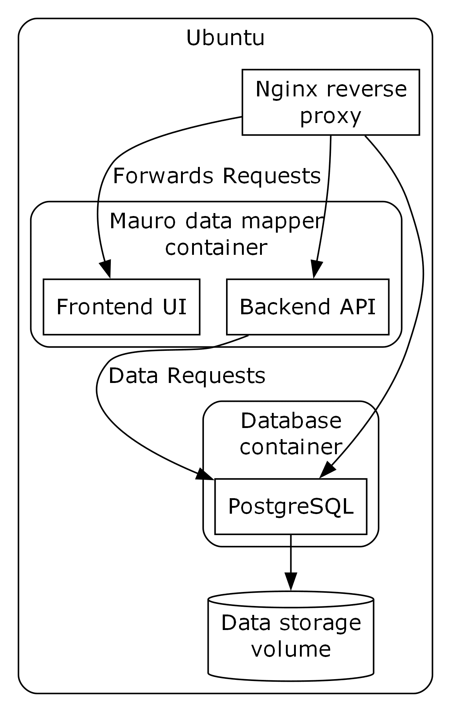

% Mauro deployment
%
%

\pagebreak

# Overview

This document covers the deployment of the Mauro Data Dictionary in Docker
containers onto AWS servers that use Nginx as a reverse proxy.

To go along with this document are some scripts which have been created to
help save some time configuring the server and building the containers.

The process involves first preparing the server which is partially automated
and partly manual—this task only needs to be done once per machine.

# Environment

The environment into which the Mauro data dictionary is deployed is an Ubuntu
24.04 LTS system with 32Gb memory and 4 cores.  The system has a minimal setup
allowing us to install the components required to run and maintain the Mauro
docker container.  One notable feature observed on the TRAINING server is that
the "Let's Encrypt" certificates appeared to be present.

## TEST server

The address of the TEST server is 13.42.94.180 with an external host name of
`mauro.dev.dataproducts.nhs.uk`

The available ports are:

*   22 — SSH (IP restricted)
*   443 — the “https” connection
*   5432 — Postgres database (IP restricted)

## TRAINING server

The address of the TRAINING server is 18.170.81.75 with an external host name
of `mauro.uat.dataproducts.nhs.uk` and has the same port configuration as the
TEST server.

## LIVE server

Details about the live server are currently unknown.

# Architecture

The data dictionary application uses two Docker containers: one to runs the web
server, the other the databasee.  The database data is stored in a Docker
volume that is placed in the large "nvme" partition.  The connection to the
internet is managed by a reverse proxy which takes care of certificates meaning
no changes are required to the Maruo build in the containers to support this
deployment.

{ height=340px }

# Preparing the servers

## Scripted part

The script `./scripts/prepare_mauro_server.sh` automates some of the
preparation work and the heading should be read before running it.  The script
can be re-run and sections skipped as required, you may, of course, prefer to
carry out these steps or similar manually.

A summary of the preparation is as follows:

1.  The script will configure a list of local users to provide them with the
    necessary group memberships to share the admin work.  The script contains a
    list of users to update and will first check these users exist.

2.  The system has a regular update which may result in the need for a restart.

3.  To install Docker it is necessary to add the Docker repository to the
    system—this step only needs to be run once.

4.  The required packages (and some useful packages) are installed

5.  The users are added to the `docker` group so they can issue Docker commands
    without needing `sudo`

6.  Users are added `id` group allowing them to work in the shared build
    directory.

## Manual tasks

After the `prepare_mauro_server.sh` script has successfully run the following
tasks need to be carried out.

Some of these tasks might be optional:

1. If you are one of the users which has just been added to the `docker` and
   `id` groups you will need to re-login for the change to take effect.

2.  Set the `hostname` for this server in `/etc/hostname`

3.  Configure Docker's data root away from the default `/var/lib/docker` if
    necessary by adding or editing `/etc/docker/daemon.json` see: [Daemon data
    directory][1] to make the directory accessible to the `id` group.

4.  Configure Nginx as a reverse-proxy (hack the
    `/etc/nginx/sites-available/default` file see: [NGINX Reverse Proxy][2] and
    the example site config described below.

5.  The Nginx will also require SSL certificates; the current configuration of
    the server seems to come with the Let's Encrypt certificates already in
    place.

6.  Nginx will need limit on uploads increasing to around 200 Mb in
    `/etc/nginx/nginx.conf` to support ingesting large files (add this in the
    `http { …` section as `client_max_body_size 200M;`

## Build the Docker containers

Two containers are used to deploy Mauro: one contains the DBMS the other the
Mauro front and back ends.  The building is carried out using the
`./scripts/update-from-github.sh` script.

Given the current requirement for three slightly different deployments we are
using long-lived git branches which maintain the different configurations these
need.  So when creating a new deployment we suggest creating a new branch (based
off of `develop`) and updating the files which require different values—see step
3 below.

1.  Copy the `update-from-github.sh` to the `/home/build` directory (make it
    executable).

2.  Set the `BRANCH_TAG` value in the script to identify the
    `nhsd-datadictionary-docker` branch to use on this server—make sure the
    branch has been pushed).

3.  If you are deploying to a new server (with a new hostname) check the
    `up.sh` (`down.sh`?) and `.env` files to ensure that they are exporting the
    correct value for `MAURO_ENDPOINT`.

4.  Run the `update-from-github.sh` script.  With all the above in place the
    site should be available via the hostname

5.  Work through the "Configuring Mauro" section of the Site setup
    documentation.

6.  Ingest a suitable branch and when that has completed create a new version

\pagebreak
# Configuring Mauro

With the site running there are a number of tasks to carry out before it can
be used.

## Administrator account

When you first access Mauro (MDM UI, not the Orchestrator), you can sign in
with the standard Mauro account created during bootstrap:

Username: "admin@maurodatamapper.com"
Password: "password"

After sign in, you will be forced to change this password to something more
secure.

## Site URL

There is a configuration token used in Mauro, particularly for email templates,
stating what the base URL is for this Mauro instance. This must be set
manually.

1.  Sign in as the administrator
2.  Click on the user menu (top-right corner) and select "Configuration"
3.  Click the "Add" button
4.  Under "Select the property to add", select "site.url"
5.  Under "Value", enter the base URL domain this Mauro instance uses.
6.  Click "Add property" to save.

## OpenID Connect

The OpenID Connect feature needs to be switched on in Mauro.

1.  Sign in as the administrator
2.  Click on the user menu (top-right corner) and select "Configuration"
3.  Click the "Add" button
4.  Under "Select the property to add", select "feature.use_open_id_connect"
5.  Under "Value", select "Yes".
6.  Click "Add property" to save.

## User groups

1.  Sign in as the administrator
2.  Click on the user menu (top-right corner) and select "Manage groups"
3.  Click the "Add" button.
4.  Create a new group called "readers", then click "Add group"
5.  Repeat for a new group called "editors".

## User accounts

Once groups are added, create the user accounts.

1.  Sign in as the administrator
2.  Click on the user menu (top-right corner) and select "Manage users"
3.  Click "Add"
4.  Enter the details for each user (see below), including the user group they
    belong in.
5.  Click "Add user" to save.
6.  Repeat for each user.

**Note**: at this point in the setup, you may not have SMTP setup yet so the
new users will not automatically get their initial password directly. It is
possible to workaround this though:

1.  Go to the "Emails" page
2.  Each email should have a status of "Failed", but the body of each
    registration email will be listed.
3.  Click the "Show more" link in each row to view the initial password for
    each user account, then send it to them manually and securely.
4.  As each user signs in, they will be forced to change their password to
    something of their choice.

The following user accounts should be created:

Name                Email                       Environments            Groups
------------------- --------------------------- ----------------------- ---------------
Peter Monks         peter.monks@systemc.com     TEST, TRAINING, LIVE    Administrators
Mike Hewlett        mike.hewlett@systemc.com    TEST, TRAINING, LIVE    Administrators
Oliver Butler       oliver.butler@systemc.com   TEST, TRAINING, LIVE    Administrators
Angela Faulding     angela.faulding@nhs.net     TEST, TRAINING, LIVE    Administrators
Cath Chilcott       cath.chilcott@nhs.net       TEST                    Editors
Kate Palmer-Lilley  kate.palmer-lilley@nhs.net  TEST, TRAINING, LIVE    Administrators
Steve Bowring       steve.bowring@nhs.net       TEST                    Readers

## Folders and Permissions

The user groups are used to determine the permissions they are allowed to do on
folders in Mauro – this is the primary permissions mechanism used.

1.  Go to the main model view page, the "Browse" link
2.  Add a new root folder (not version controlled) called "Data Dictionary"
3.  Select the "Data Dictionary" folder in the tree so the details appear on
    the right hand side
4.  Click the "User & Group Access" toolbar button then in the dialog, set the
    groups and their roles.


*   Someone in the "Readers" group only has read access to this folder and all
    models below
*   Someone in the "Editors" group has read and write access to this folder and
    all models below
*   Administrators have full access regardless

## Ingest a dictionary branch

You will need to ingest a data dictionary XML file to have the dictionary
populated in Mauro. There is no UI for this, you will need to use a HTTP
request tool like Postman.

You can get the Mauro REST API Postman collection by going to [Mauro Data
Mapper][3] and clicking the "Run in Postman" button. This will help with some
of the standard requests to send.

Also, create a separate Postman environment to alter some of the variables:

1.  Click on "Environments" in Postman

2.  Duplicate the "MDM Development" environment and call it "MDM – NHSE DD
    TEST" (or mapped to which environment you need)

3.  Open the variables list and change:
    a.  Base_url – use the domain of the environment with "/api" at the end
    b.  Email/Password – use the correct administrator credentials for the
        environment

### Ingest files

These are large XML files containing all information to translate into Mauro
objects. These can be found in Ingest files

### Login as administrator

Use the POST Login request to sign in as the administrator for the session.
Remember to use the "admin@maurodatamapper.com".

### Ingest a released branch

A released branch is a previously released copy of the data dictionary e.g.
"May 2024". This should be finalised in Mauro since it has already been
completed.

Create a request in Postman to send this request to ingest a file:

`POST {{base_url}}/nhsdd/ingest`

Form-data:
```
    ingestFile         – XML file to upload
    finalise           – true
    releaseDate        – e.g. "May 2024"
    folderVersionNo    – e.g. "2024.5.0"
    prevVersion        – A UUID to the previous version e.g. if ingesting
                       - "May 2024", use the UUID pointing to the previously
                       - ingested "March 2024" versioned folder. If this is
                       - the first one being injected, ignore this parameter
    async              - true
```

By setting "async=true", the response back should be 202 Accepted. To review
the progress of the ingest:

1.  View the async job list in Mauro, and/or
2.  Watch the Mauro log file progress directly from a remote SSH connection
    (recommended)

The ingest should take around 2-4 minutes.

Once completed, move the new versioned folder to inside the "Data Dictionary"
root folder in Mauro UI.

### Ingest an in-flight migration branch

These branches are work the NHS Data Dictionary team are working on now in
their current system which will need to be migrated into Mauro for
testing/confirmation. This should not be finalised in Mauro.

Similar request in Postman as above:

> `POST {{base_url}}/nhsdd/ingest`

Form-data:
```
    ingestFile  – XML file to upload
    branchName  – The name to give the branch. They usually name them after
                  their change request numbers e.g. "CR1915 - [Name]"
    prevVersion – A UUID to the previous finalised versioned folder that is
                  the base for this branch
    async       – true
```

Same as above, watch and wait for the ingest to complete.

\pagebreak
# Appendix

## 1. Example Ningx default site script

The following example has been taken from the TRAINING site:

```
  server {
      if ($host = mauro.uat.dataproducts.nhs.uk) {
          return 301 https://$host$request_uri;
      }

      listen 80 ;
      listen [::]:80 ;
      server_name mauro.uat.dataproducts.nhs.uk;
      return 404;
  }

  server {
      server_name mauro.uat.dataproducts.nhs.uk;

      listen [::]:443 ssl ipv6only=on;
      listen 443 ssl;

      ssl_certificate /etc/letsencrypt/live/mauro.uat.dataproducts.nhs.uk/fullchain.pem;
      ssl_certificate_key /etc/letsencrypt/live/mauro.uat.dataproducts.nhs.uk/privkey.pem;
      include /etc/letsencrypt/options-ssl-nginx.conf;
      ssl_dhparam /etc/letsencrypt/ssl-dhparams.pem;

      location / {
          proxy_pass http://127.0.0.1:8080;

          proxy_connect_timeout 600;
          proxy_send_timeout 600;
          proxy_read_timeout 600;
          send_timeout 600;
      }
  }
```
*Note: in some of the deployed sites the configurations include
"managed by Certbot" comments which probably should be left in place*

---

[1]: https://docs.docker.com/config/daemon/#daemon-data-directory (Docker data directory)
[2]: https://docs.nginx.com/nginx/admin-guide/web-server/reverse-proxy/ (NGINX Reverse Proxy)
[3]: https://documenter.getpostman.com/view/9840589/UVC8BkkA (Mauro Data Mapper)

